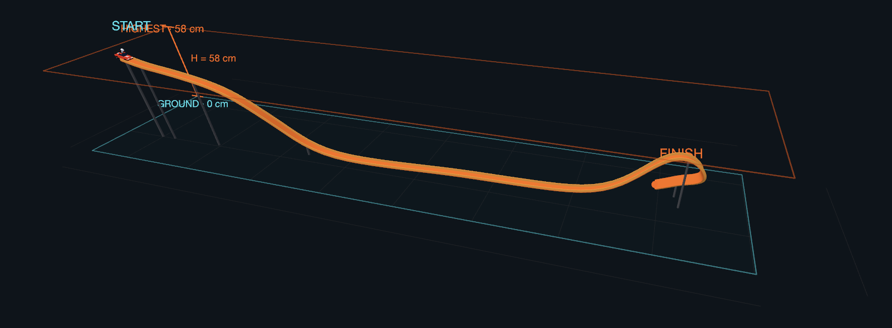
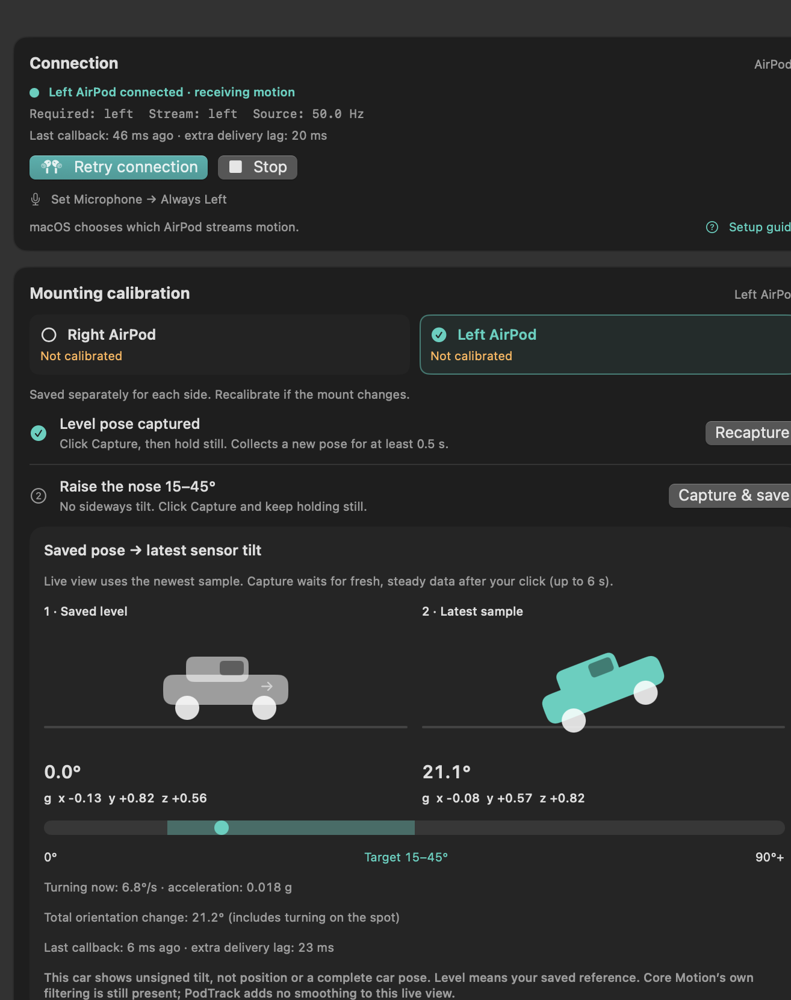

# PodTrack

**A native macOS motion lab for an AirPod mounted on a Hot Wheels car.** Record motion, inspect the evidence, and reconstruct an experimental track and speed profile using a measured height or track length for scale, or relative units when both are unknown.

Repository/project: `airpods-hotwheels-track`. Application: **PodTrack**. SwiftUI, Core Motion, Swift Charts, SceneKit, Foundation, and AppKit only. No remote service, web UI, third-party runtime, or network dependency.

**There is no true absolute position or direct speed measurement.** Height-constrained geometry and speed are estimates, often with substantial drift. A single height constraint does not make the reconstruction unique. The car needs a rigid mounting and must keep its orientation aligned with its travel direction for useful results.

## Build and launch

Requires **macOS 14+** and **Xcode 15+ / Swift 5.9+**. Development validation used Xcode 26.6 and macOS 26.6.2; the deployment target is 14.0, but a physical macOS 14 machine has not been tested.

From the repository root:

```sh
bash scripts/build.sh
open build/PodTrack.app
```

The build script compiles the Swift package, creates a fresh `.app` bundle with `NSMotionUsageDescription`, signs and verifies it locally with an ad-hoc signature, then replaces `build/PodTrack.app`. It prints the version and full path; Finder's bundle modification date reflects the packaging time. It embeds the same plist in the executable for developer command support. This is a local prototype, not a notarized distribution build. Launch the **app bundle** for hardware access; a terminal's responsible process can affect macOS privacy attribution.

**After rebuilding, quit the previously running PodTrack with ⌘Q and open the bundle again.** Replacing the executable does not update an already open process; `open` alone can bring the old window forward. Version **0.10.3** is shown under the PodTrack name in the sidebar. The app opens **Record Run**, with **Record** at the upper left and **Track height H** directly beneath it, defaulting to **Unknown**. Select **Measured** and enter H only when you have measured it. A recording saved as Unknown stays Unknown in Run Analysis, Track Visualization and Saved Runs & Compare, even if you change the setup for your next recording. Existing saved runs retain their original heights. **Height & record** in the toolbar and **Set height H & record** in Diagnostics return to that screen.

If you still see only the old **Headphone motion diagnostics** page, select **PodTrack → Quit PodTrack** in the menu bar (or press ⌘Q while PodTrack is active), then double-click **this repository's `build/PodTrack.app`**. Closing the window with the red button is not the same as quitting. A different build folder is not required. Older builds reused the outer `.app` directory, so Finder could show its original date even though the executable inside was newer; the build script now replaces the complete bundle.

Alternatively, open **PodTrack.xcodeproj**, select the **PodTrack** scheme and **My Mac**, and Run. The app links the local `PodTrackCore` Swift package. The project is included; after adding or moving app source files, regenerate it with:

```sh
python3 scripts/generate-xcode-project.py
```

Python is used only by this optional project-generation script. The app itself is entirely Swift. Core unit tests are a Swift package test target; run them with the script below, or open `Package.swift` in Xcode to use its package test scheme.

Capture now waits for new samples after the click and retries pose validation every 0.1 seconds for up to 6 seconds. At least 0.5 seconds of continuous steady data is required; gaps, mixed sensors and slowly settling tilt are rejected. Click once and keep the car steady; the inline message shows progress and Cancel stops the attempt. Switching buds/sources or stopping motion cancels pending capture. Invalid angles and unstable poses remain rejected.

## Stability improvements (0.8.2)

- Capture establishes its source-time boundary after flushing pending callbacks. Pre-click samples cannot complete it. Each pose needs at least 10 valid samples spanning 0.5 s, strictly increasing timestamps with no gap over 120 ms, and one sensor. The existing stillness limits remain; a gravity-direction change over 1° between the first and last thirds of the pose also rejects a slowly settling reference. Capture cannot commit after its six-second deadline.
- Reconstruction smoothing integrates a piecewise-linear signal over elapsed time rather than counting samples. Inserting interpolated samples does not change the result. Window edges are clipped to measured data, and the live display still has no app smoothing.
- A full orientation step more than 20° beyond the gyro travel bound is rejected before reconstruction. This catches sudden yaw-reference resets even when gravity stays consistent. It does not certify smaller/gradual changes or unobserved motion in a gap.
- Exported analyses identify **0.4.0-heuristic**. Saved raw recordings and mounting profiles keep their original data; reanalysis can produce updated estimates or explain why a trace is unusable.

These changes address reproducible data-handling errors. Physical accuracy still needs known-angle calibration checks, a measured straight ramp, and video/independent timing. Stable graphics and synthetic tests alone do not establish position or speed accuracy.

## Live tilt and delayed motion (0.8.1)

The car in mounting calibration shows **unsigned tilt relative to the saved level pose**, not position, heading, or a fully calibrated car pose. “Level” means the pose you captured; an incorrectly captured reference remains incorrect. The live car now uses the **newest delivered gravity sample**, with no PodTrack moving average or animation. The separate **Capture window (0.6 s)** remains averaged and checked for stillness. The total attitude-change readout includes yaw, which can change while gravity-relative tilt stays near zero.

Headphone callbacks run on a dedicated serial queue. A lock-protected handoff batches delivery to the app at up to 30 Hz. Every accepted sample reaches recording and calibration in source order, while the live view shows the newest one. Recording boundaries flush pending samples. General telemetry updates at 10 Hz, without publishing every sensor value to the whole window. Duplicate/backwards source timestamps do not refresh sample freshness. Retry the connection if source time restarts.

Diagnostics now distinguishes **source rate**, **arrival rate on the Mac**, **callback → app delay**, and **extra delivery lag**. The latter compares elapsed source and host time relative to the best delivery since connecting; it does **not** measure constant Bluetooth latency or filtering inside Core Motion. A source rate of 50 Hz does not prove low latency. Growing delivery lag of 1 second or more blocks calibration and starting a run. A missing callback for 1 second still ends recording.

If motion continues changing after the physical AirPod stops, inspect the latest gravity and rotation rate together with these timing fields. App-side averaging previously added up to 0.6 s of settling, and the former main-queue callback/UI design could fall behind while laying out the window. Remaining delay must be measured on hardware. Core Motion values already contain sensor fusion; the app cannot remove unknown upstream filtering simply by increasing redraw frequency.

[Kinapod’s technology page](https://kinapod.com/technology/) reports its own iPhone measurements and recommends disabling Automatic Ear Detection and fixing the microphone to one bud on iPhone. Those results and settings are not a macOS latency guarantee. [Apple’s headphone-motion presentation](https://developer.apple.com/videos/play/wwdc2023/10179/) describes processed motion, one streaming bud at a time, and ear-detection effects on that selection.

Native UI verification (synthetic data, isolated library):

```sh
build/PodTrack.app/Contents/MacOS/PodTrack --render-calibration build/verification-calibration
```

## Height unknown

In **Record Run → Track height H**, choose **Unknown**. Mounting calibration and usable motion are still required. Without a measured height or track length, the estimated centerline has a total length of **1 relative unit (u)**. 3D, graphs, A–B measurements and CSV/JSON exports use **u** and **u/s**; timing, angles and observed acceleration keep their original units. Flat motion can produce a relative path; stationary recordings cannot.

The saved run retains the unknown height, calibration and untouched motion. Add H later in the 3D view or **Edit saved run** to reconstruct the same recording in metres. A measured along-track length can set a uniform physical scale even without H. Adding either measurement does not verify the shape.

If any selected comparison has an unknown scale, every displayed path is normalized to **1 u** for comparing shape and progress. Saved analyses keep their original units and values.

## Interactive guide · English / Українська

Open **How It Works** in the sidebar or **Help → How PodTrack works · Як це працює**. Six illustrated steps explain the AirPod sensors, mounting calibration, direction, speed, trajectory integration, and height scaling. Switch between English and Ukrainian at the top; the choice persists.

The opening Sensors step shows accelerometer and gyroscope signals flowing through Core Motion into gravity and motion acceleration. Compare At rest, Steady speed and Speeding up to see why zero acceleration does not prove a stop. Expand The data, briefly for the API fields, units and Apple documentation.

Change the nose-up angle, turn and slope, scrub a synthetic run, or move H from 29 to 87 cm to see the trajectory, length and speed scale together against a fixed 58 cm reference. The speed and path example uses the production reconstruction pipeline on generated motion. Every example is educational; guide controls do not change recording settings, saved runs or calibration, and do not request hardware data. Expand **The maths, briefly** for the equations or **Where errors come from** for limitations. **Set up a run** returns to recording.

## What is measured, and what is estimated?

| Value | Provenance / units |
| --- | --- |
| Attitude quaternion, roll/pitch/yaw | Core Motion's sensor-fused orientation; radians in raw exports |
| Rotation rate | Core Motion, rad/s |
| User acceleration and gravity | Core Motion, g in raw exports |
| Timestamp and sensor location | Core Motion monotonic source time; left/right/unknown |
| Receipt age and sample rate | App receipt clock / differences between source timestamps |
| Vertical/tangential signals | Projections of Core Motion output; m/s², not additional sensors |
| Slope, bank, heading, turning, curvature | Derived from mounting calibration, gravity, attitude and reconstructed speed |
| Speed, XYZ path, path length, segments | Heuristic, constrained estimates; **not ground truth** |
| Simulation values | Explicit synthetic input, marked in the UI, saved runs, and exports |

Here, “measured” means delivered by Core Motion. `CMDeviceMotion` is already processed sensor fusion, not access to unfiltered AirPods ADC data. Raw CSV means **unchanged API values**. No magnetic heading, GPS, UWB ranging, direct velocity, or Mac-relative location is used.

## Hardware diagnostic: do this first

Use compatible headphones that support spatial audio with dynamic head tracking, such as AirPods Pro. Actual model, OS, connection state, and firmware support are determined by the API at runtime. Apple describes [macOS headphone motion and sensor switching in WWDC23](https://developer.apple.com/videos/play/wwdc2023/10179/) and the [CMHeadphoneMotionManager API](https://developer.apple.com/documentation/coremotion/cmheadphonemotionmanager).

1. Connect the AirPods to this Mac using Bluetooth. Launch **PodTrack.app**.
2. Open your AirPods settings on iPhone or Mac and set **Microphone → Always Right** or **Always Left** to match the side you plan to record. If needed, open **Audio & Routing** first. See the [annotated setup screenshot and Ukrainian instructions](docs/AIRPODS_SETUP.md), also available in **Connection → Setup guide**. [Apple explains the microphone options](https://support.apple.com/108764).
3. Keep **AirPods** selected in the sidebar. In **Record Run** or **Diagnostics**, select **Right AirPod / Left AirPod** and click **Connect AirPods**. Right is selected on a fresh launch. If motion permission was already granted, the app starts one connection attempt automatically when its window opens; otherwise allow the permission after clicking Connect.
4. Look for **Motion available: YES**, authorization **Authorized**, increasing sample count, a recent sample age, and a stable observed Hz. API-active alone is not proof that samples arrive.
5. Move only the bud you intend to mount. Verify the live values respond and check **Required** versus **Stream** in the connection card (or **Sensor location** in Diagnostics). Recording and mounting calibration require fresh motion from the selected bud. Data from the other bud remains visible for diagnostics and buffer CSV export, but cannot enter a run.
6. Mount it rigidly. Recheck the signal outside the ear before a track run. If Automatic Ear Detection stops the stream, inspect that setting in the AirPods controls. You may need to disable it yourself; behavior varies. Do not assume a bud in a case or outside an ear will necessarily stream.

The API chooses one sensor at a time; **PodTrack cannot force left/right selection, request both buds, set sample frequency, or set a headphone attitude reference frame**. These setters are not in the installed headphone-motion SDK. A sensor switch clears unfinished calibration poses and ends recording before mixing samples. Completed Left and Right mounting profiles are retained. No connection, denied access, missing samples, and Core Motion errors are shown directly; simulation is never a fallback.

The horizontal **Right / Left** selector is a recording requirement, not a hardware handover command. PodTrack cannot determine whether one or both buds are connected from the single motion stream. If Right is selected while the system streams Left, the card says **Waiting for the right AirPod** and identifies the actual left stream. It never silently substitutes the other bud. Changing the selection loads that side’s saved calibration and clears unfinished poses and the live plot buffer; it is disabled while recording. The same selector is available beside the Record button and in Live Dashboard. To try to move the stream to the chosen bud, keep the other in its case, reconnect and confirm the reported side; this is not guaranteed to control Core Motion. Apple’s **Always Left/Right Microphone** setting controls audio input and is not a motion-sensor selector.

Connection status distinguishes **Waiting for headphone motion**, **Connected · waiting for motion**, **Receiving**, a different/unknown bud, stale samples and denied permission. **API active** with zero samples is not presented as usable motion. While waiting for motion or when samples go stale, a visible hint explains that Automatic Ear Detection may be stopping motion: put the AirPods in your ears, turn that setting off in System Settings → your AirPods, then retry. The hint disappears when fresh motion arrives. **Retry connection** creates a new Core Motion manager, ignores callbacks from the previous session, and clears stale samples and unfinished poses, while preserving completed mounting profiles. Fresh motion from the selected side is still required. **Stop** stops motion and saves an active run. Automatic startup happens only once per launch with an existing motion permission; opening the window again does not undo an explicit Stop.

**No motion data:** after ten seconds without a valid sample (following motion authorization), the spinner becomes an explicit no-data state. The session keeps listening, so a late sample can recover without another click. **Copy diagnostics** includes permission, availability, API activity, accepted/rejected sample counts, the latest Core Motion error, timing, and recent events. It is also available in Diagnostics. An active API or confirmed Bluetooth connection does not enable Capture; fresh motion from the selected side is required. Retry fixes a session recovery weakness, but a successful hardware stream still needs to be verified on the Mac.

For permission issues, check **System Settings → Privacy & Security → Motion & Fitness**, then relaunch the app. Perform hardware diagnostics through the app UI; direct command-line launching from an agent host can receive a different macOS privacy attribution.

## Record a physical run

Before recording, measure the construction with a ruler or tape measure. **H is the vertical distance from the lowest point/ground to the highest point of the construction**; it is not the rail length or the straight-line distance from start to finish. For example, if the top of the construction is 58 cm above the ground, choose **Measured** and enter **58 cm** (0.58 m). Keep the measurement vertical and use the same lowest and highest points that the car visits during the run. If the height is not known, leave H as **Unknown** and add it later.



*Example measurement: **GROUND = 0 cm**, highest point **H = 58 cm**. The orange track and speed are still reconstructed estimates from the motion recording.*

1. In **Record Run**, **Track height H** defaults to **Unknown**. You can record immediately without a height measurement; the reconstructed path uses relative units unless you provide a measured track length. To set a height, select **Measured** and enter the vertical distance in the left column, just below **Record**. The small up/down arrows change H by **1 cm per click**; these also appear beside the height fields in the 3D view and saved-run editor. A saved Unknown recording can be changed later using **Measured → Apply height**, or **Edit name & height → Save & reconstruct**. To remove its height, choose **Unknown → Apply unknown**. Pending height edits are labelled until applied. Track/car names are below in **Run details**. Measure vertically, not along the track.
2. H is the **highest-to-lowest height range**. The lowest reconstructed centerline point becomes ground at 0; the highest becomes H. Record a complete pass that visits both levels. The finish may be elevated, and the shape comes from the motion recording. Old recordings retain their original endpoint-drop interpretation until explicitly changed.
3. Calibrate the rigid mounting with the **same streaming bud**:
   - Place the car on a level surface and hold still for 1 second, then click **Capture level pose**.
   - Raise only the nose roughly 15–45°, without side roll, hold still for 1 second, then click **Capture & save** for the selected side.
   - The completed calibration is saved automatically for that side. Calibrate the other bud separately; switching sides or relaunching restores the matching profile. Use **Recalibrate Right** / **Recalibrate Left** after changing the mount or using another AirPods pair. Return the car to the track. The two poses determine a continuous forward direction in the device frame; no fixed AirPod axis is assumed forward.

   

   *Calibration example: first capture the car level, then raise only the nose 15–45° while keeping the car steady and avoiding sideways tilt.*

4. Use the **Right AirPod / Left AirPod** selector directly above the recording controls. Check **Using Right/Left AirPod calibration**, then click **Record Right AirPod** or **Record Left AirPod**. Keep still for 1 second, release the car, then record another 1 second after it stops. Click **Stop & save** before picking the car up; the recording title identifies the AirPod side.
5. **Run Analysis** opens automatically using **Improved**, including when you previously selected Old. If reconstruction is unsupported by the recording, its raw data remains available with the reason displayed. You can select **Old** to inspect the original method.

Recording is independent of the 1,500-sample rolling plot buffer. Pausing plots and clearing that buffer do not remove recorded samples. Source changes are disabled during recording. Recording is capped at 180 seconds. A source timestamp gap over 0.5 s, bud change, or no new receipt for more than 1 s ends the recording at its last accepted sample and records a reason. Duplicate/non-increasing or invalid samples are rejected and counted. Stop-motion and normal app termination save an active run. An OS crash or force-quit can lose an in-progress recording; there is no journal yet.

Use **Raw-only recording** to capture diagnostics without calibration; that run will not get a fabricated path. Keep **Start and end at rest** enabled only when the endpoints support that assumption. Quiet straight-line motion is indistinguishable from rest using an IMU alone; the algorithm only trims quiet edges, never quiet middle sections.

## Compact recording screen

The Record Run screen fits without needing to scroll at the supported minimum window size (1100 × 760 pt). The left column has **Record** and its Right/Left selector, **Track height H** with 1 cm arrows, and compact Track/Car fields. The right column keeps **Connection** and the two saved mounting profiles together, with both capture steps visible when needed.

Use **Notes & advanced settings…** under the names to edit notes, known track length, height interpretation and reconstruction settings in a separate sheet. **Recording help**, **Calibration help** and **Connection → Setup guide** open the longer instructions without expanding the page. Setup guide first opens a small reminder below the button: choose Microphone → Always Right/Left and turn Automatic Ear Detection OFF. Its screenshot button opens the illustrated guide, with Mac selected by default and an iPhone tab. The Microphone instruction follows the selected side. Connection warnings and the active recording controls stay on the main screen.

## Left and Right profiles and run identity

**Mounting calibration** shows separate Left/Right cards with saved status and the capture date for the selected profile. Completed profiles persist under `~/Library/Application Support/PodTrack/Runs/Calibrations/left.json` and `right.json`. Switching or retrying motion retains both. Each profile describes the current rigid mounting of that side, not a particular serial number or car: recalibrate after moving it or changing the AirPods pair. Starting a replacement calibration removes only that side’s previous reusable profile; an unfinished replacement cannot silently fall back to the old mount. If saving fails, the profile remains usable in this session and offers **Retry saving calibration**.

Each recorded run keeps its own calibration snapshot and original samples. Recalibrating a side never changes old recordings. Run names, the saved library, picker, 3D legends, analysis, editor, and exports identify the actual recorded side, for example **Hot Wheels · Left AirPod**. Older raw-only runs derive their side from their saved samples. Unknown or mixed sides are labelled explicitly; synthetic runs are labelled **Simulation**. Export filenames include `left`, `right`, `unknown`, `mixed`, or `simulation`; reconstructed CSV adds `recorded_from`, and processed JSON includes `recordedOrigin` and `displayName`.

Record one car, stop and save, switch to the other side and record the second car. In **Saved Runs & Compare**, tick both runs to view them together. Search accepts **Left** or **Right** as well as names and dates. The selector chooses the required source and its saved mounting profile; it cannot force macOS to hand over the motion stream or record both AirPods simultaneously.

## Simulation

1. Explicitly choose **Simulation** in the sidebar.
2. Open **Record Run**, enter H, choose **Curved circuit**, **S-bends**, or **Raised finish**, optionally include a jump, and click **Simulate & record** in the upper-left Record card.
3. A 6.8-second, 50 Hz kinematic pass runs through the real source callback, recorder, persistence, and processing path. A known synthetic mounting is applied automatically. These are synthetic inputs for exercising different geometry, not reconstruction templates.
4. Repeat to create multiple comparison runs. Small deterministic variations exercise comparisons.

Simulation ground-truth positions are used only to generate test inputs and validate the algorithm. **The reconstructor receives motion samples and calibration, never those ground-truth positions or velocities.** Simulation does not validate real AirPods fidelity or their behavior on a car.

## Interpret the views

- **Diagnostics:** real connection/availability/authorization, API active state, bud location, receipt age, observed frequency, quaternion, Euler angles, all acceleration/gravity/rate components and magnitudes, and a bounded event log.
- **Live Dashboard:** rolling sensor-frame plots, sample-rate jitter, pause/resume, clear, record/stop, and buffered CSV export. Plot thinning is for display only.
- **Run Analysis:** run metadata, speed/length/duration, candidate segment list and layered timeline, raw evidence, and detailed assumptions and scale corrections. Click a segment or scrub time to move all markers. Speed charts also support distance along the path.
- **Track Visualization:** simple orange SceneKit road with raised rails and sparse supports. Drag to orbit, scroll to zoom, or **Fit view** to reset. **Play run / Pause** replays a red sports car with a rear spoiler and a visible white AirPod mounted on its roof. Wheels turn with replay distance, and the car follows the road through slopes, turns, and upside-down loop sections. Pausing and moving the time cursor also stop or seek the car and wheels. The charts stay synchronized. Saved Runs & Compare also uses red cars, with stripes matching each run’s track colour. Ground and highest-level planes show 0/H with a height bracket. **Height planes** can hide them; **Speed colors** preserves the telemetry coloring. Event dots are optional. The car, AirPod, road width (illustrative 6 cm), thickness, rails, roll and supports are schematic, not measured dimensions or mounting orientation.
- **Measure A–B:** turn on the ruler, then click two points on the road. Cyan is A, pink is B. Read **Straight A–B**, **Along track**, **Horizontal**, and signed **Δ height (B − A)** in cm. Dragging still rotates. For precise time selection or overlapping parts, move the cursor and click **Set A at cursor / Set B at cursor**. **Pick A/B** chooses which endpoint the next click replaces; **Swap** and **Clear** are available. Measurements snap to/interpolate the original centerline, not the road edges or display-thinned mesh. These remain estimates, with no metrology accuracy claim.
- **Height H:** enter one cm value in the 3D panel and **Apply height** to reconstruct a saved run. Measurements retain their selected times and update with the new scale. An optional known along-track length is under advanced setup / saved-run editing. Height-range mode does not require a lowest finish or a fixed track template.
- **Top-down XY:** equal horizontal axis scale. X points along the initial horizontal forward direction, Y left, Z upward. X/Y start at the run's start. There is no north or Mac-relative reference. **Side profile:** estimated distance along path versus height above the lowest point, with lower/upper guides; chart axes scale independently.
- **Saved Runs & Compare:** tick two to four reconstructed runs in the library beside the 3D view to see their colored roads together in one 3D scene, plus XY overlays, speed profiles, duration, length, maximum/mean speed, and timing by segment type. **Play together**, **Pause**, **Restart**, and the time slider move all run markers relative to each candidate release; shorter runs hold at their final point. **Fit all** frames every selected trajectory, and **Height planes** toggles the common ground/highest planes. Each legend shows car/run identity, AirPod side (or Simulation), and H. Ground is Z=0 for both new and legacy recordings; starting X/Y and initial heading are aligned, and metric scale is preserved for each run. Actual lane spacing is unknown, and identical paths overlap. Different scales or calibrations can account for apparent differences. Selections remain when navigating to another page in the same app session. Failed or raw-only reconstructions show their status and do not create invented 3D paths.
- **Export:** raw CSV, processed metrics/signals/quality JSON, and reconstructed-point CSV. Estimates remain explicitly named in export fields.

Candidate segments include start, release, downhill, flat, uphill, left/right turns, bumps, possible airtime/landing, and finish/rest. Slope, turn, and event layers overlap. **Do not sum their lengths or durations.** Average run speed uses the candidate motion interval, not the full recorded pre/post-roll. Peak user-acceleration magnitude is a scalar derived from observed API values; it is not an independently estimated speed derivative or a force measurement.

Saved runs can be edited with **Edit constraints & notes**. An optional known **total along-track length** in cm can be added later. This is not the straight-line finish distance. Estimates are recomputed; raw samples remain attached to the run.

## Compare two cars

Record one car at a time. Name the first **Car A**, calibrate its mounted AirPod, record, then **Stop & save run**. Repeat for **Car B**, recalibrating after changing the mounting or streaming bud. You can reuse one AirPod or use different buds in separate runs. Open **Saved Runs & Compare** in the sidebar (or **Compare runs in 3D** above a single track), tick both, and choose **Play together** to inspect their estimated trajectories in the same 3D view. Add up to two more saved runs for comparison.

**Latest 2 ready** selects the two most recent reconstructable trajectories. Opening the library alone does not select anything; opening it from a single track includes that track. Raw-only and failed recordings remain visible with a reason and a **View recording** action, but cannot be selected as 3D paths. Search by car, track, date or run ID; **Edit name & height** updates a saved run. Selected rows and scene labels share stable colours; untick or use the × on a scene label to remove a run. Detailed charts are under **Speed, distances & segment timings**.

The single-track and analysis screens show recording checks near the result. Missing stillness at an endpoint is explained with a concrete next-run instruction, using the selected method's endpoint detection. These checks are not an accuracy score.

One AirPods pair supplies only one motion stream at a time through Core Motion. Simultaneous left/right recording on two cars is not supported; multiple manager instances cannot select separate buds. This comparison replays saved runs aligned to their release events and does not imply they were captured simultaneously.

## Reconstruction method

**Improved is the default** in Run Analysis, Track Visualization, Saved Runs & Compare and Export. The shared **Improved / Old** switch selects the method for geometry, measurements, metrics, charts and exports across all these screens. New recordings always open with Improved. A method that cannot reconstruct a recording shows its error; it does not silently substitute the other method. Switching methods resets playback and measurements. Edits invalidate both methods' cached results.

See [docs/IMPROVED_RECONSTRUCTION.md](docs/IMPROVED_RECONSTRUCTION.md) for the improved fit and its limits. [docs/RECONSTRUCTION.md](docs/RECONSTRUCTION.md) documents the original **Old** pipeline:

1. Validate continuous timestamps, a single sensor, and the mount; project acceleration along gravity/forward and determine slope from gravity.
2. Check direct/inverse attitude conventions against gravity consistency and gyro sign. Express relative heading in a gravity-aligned start frame and unwrap before smoothing.
3. Integrate tangential acceleration with a small slope/gravity prior, an inferred or user-selected acceleration sign, quiet-edge bias estimation, optional endpoint velocity correction, smoothing, and nonnegative speed.
4. Integrate forward direction times speed. Uniformly rescale XYZ and speed to fit the entered highest-to-lowest H, then translate the lowest point to Z=0. Reject stationary, nearly flat, or extreme-scale solutions. The legacy endpoint-drop mode also requires a net descent.
5. Optionally fit known along-track length by a disclosed horizontal scaling. Detect candidate events, compute metrics, and attach provenance/quality notes.

### Compare reconstruction methods

Click **Compare algorithms** in the toolbar or press **Command-Shift-K** to open a separate window. Choose a saved recording and inspect **Current method** (0.4.0) and **Improved method** (0.5.0 experimental) side by side. Both use the same raw samples and measured height/length, with shared playback, a shared time cursor, a speed overlay and common initial camera framing. Drag either road to orbit it, or choose **Fit both views** to reset the cameras.

The improved method smooths full 3D direction vectors, fits nonnegative speed to acceleration and turning evidence, and constrains matching repeated circuits to return to the same place with similar traveled distances. It detects complete inversion-to-inversion direction sequences; it does not assume three laps or use the photo as a track template. Switch **Use matching repeat circuits** off to inspect the fit without those constraints. The detector currently needs at least two matching complete intervals containing inversions.

The latest recording produces three matched circuit estimates of about **6.47 m each**, compared with **2.00, 6.01 and 1.08 m** from the baseline. The sustained zero-speed/rotation mismatch is absent in the improved result. These are consistency improvements: the fitted distances and speeds still need independent measurement. **Fit details and limitations** exposes solver convergence, sensor residuals and assumptions.

The separate comparison is computed in memory; opening it does not replace saved recordings or their settings. It always shows both methods, independently of the shared method selector in the main window. See [the implementation and validation report](docs/IMPROVED_RECONSTRUCTION.md) for equations, results and known limits.

### Delete and restore recordings

Use the trash button on a saved-run card, or **Delete recording** beside the run picker in Run Analysis or Track Visualization. Deletion removes that recording from the active library and comparison, cancels pending reconstruction and clears its cached results. If the displayed recording is removed, the next available run is selected.

The recording moves to **Recently Deleted**, stored locally under `Runs/RecentlyDeleted/`. Use **Undo** immediately or **Recently Deleted → Restore** later, including after restarting the app. Raw samples, calibration, names, height and notes are retained. Removed recordings are not automatically purged. If writing or moving the file fails, the app keeps the recording visible and reports the error; restoration never overwrites an existing recording with the same ID.

## Files and exports

Runs are stored as versioned, atomically written JSON files under:

```text
~/Library/Application Support/PodTrack/Runs/
```

No runs are uploaded. The library reports unreadable files instead of silently dropping them. Failed saves retain runs in memory and provide **Retry save**; export before closing if retry fails. Analysis is cached in memory and deterministically rebuilt from the raw session and settings when needed.

Raw CSV preserves timestamps, quaternion, Euler angles, rotation rate, user acceleration, gravity, sensor location, and source. It adds elapsed time and projected vertical/tangential user-acceleration columns; tangential values are blank without calibration. These projected signals retain the sensor's sign convention. Track CSV includes time, **estimated** x/y/z, speed, distance, curvature, and candidate segment labels. Analysis JSON includes metadata, height interpretation, coordinate convention, mounting, algorithm version, signals, metrics, segments, inferred sign, scale factors, endpoint correction, and warnings. New height-range runs use Z=0 at ground and Z=H at the highest point. Older recordings without `heightConstraint` retain start Z=0 / finish Z=−H; no raw recordings are migrated. The `verticalDrop` and `enteredVerticalDrop` JSON field names are retained for compatibility and interpreted according to `heightConstraint`. Acceleration in processed JSON uses m/s²; orientation uses radians except explicitly named degree fields.

## Validate the prototype

```sh
bash scripts/test.sh
bash scripts/build.sh release
build/PodTrack.app/Contents/MacOS/PodTrack --verify-simulation build/verification --render
```

The last command explicitly generates a verification fixture, records it, checks local persistence, reconstructs it, writes all three exports, and renders the actual SceneKit scene plus native SwiftUI chart components into `track-3d.png` and `native-report.png`. It also renders the 58 cm setup screen and `comparison-3d.png`, showing three synthetic trajectories with their common replay controls. It uses a separate library under `build/verification/Runs`, not your app library. `verification.json` reports the checks. Omit `--render` in an environment without a Metal device. Native rendering may require an ordinary macOS session outside a restricted execution sandbox.

To render the algorithm comparison and export both analysis JSON files from the regression recording:

```sh
build/PodTrack.app/Contents/MacOS/PodTrack --render-algorithm-comparison \
  Tests/PodTrackCoreTests/Fixtures/repeated-circuit.json build/improved-comparison/rendered
```

To launch directly into the separate comparison window without starting the motion stream:

```sh
open -n build/PodTrack.app --args --compare-algorithms
```

The integrated library acceptance command uses isolated fixture copies to check both methods, switching during analysis, edit invalidation, exports, deletion during analysis, restoration after restart, failed removal and the actual simulation recording/save flow, including Unknown height after restart, later height edits and scale from a measured length. Add `--render` to render the native controls and scenes:

```sh
build/PodTrack.app/Contents/MacOS/PodTrack --verify-library \
  Tests/PodTrackCoreTests/Fixtures/repeated-circuit.json build/default-improved/verification --render
```

Tests cover buffer order, sampling statistics, arbitrary mounting calibration, invalid poses, recording boundaries and sensor switches, persistence/CSV, smoothing, heading wrap, curvature, analytic ramp speed/geometry, quaternion conventions, synthetic turns/jump/landing, quiet middle sections, constraints, and invalid/degenerate inputs. Passing synthetic tests is not a measurement-accuracy guarantee. See [docs/VALIDATION.md](docs/VALIDATION.md) for the development results and hardware test to report back.

## Architecture and remaining limitations

`PodTrackCore` contains `MotionSample`, vector/quaternion math, `MotionBuffer`, `MountCalibration`, `RunRecorder`, `RunSession`, `RunStore`, `CSVExporter`, `SignalProcessor`, `SpeedEstimator`, `RunSegmenter`, `TrackReconstructor`, `MetricsCalculator`, `AnalysisPipeline`, and the deterministic simulation generator. The app's `MotionSource` abstraction has `AirPodsMotionSource` and `SimulatedTrackMotionSource`. `AppModel` coordinates shared diagnostics/dashboard/recording/library state and background analysis. SwiftUI views and SceneKit construction live separately from physics and persistence.

Absolute position, initial velocity, and a unique full track shape are unobservable here. AirPods are designed for head motion, not toy-car metrology; latency, filtering, dynamic range, limited update rate, impacts, mount vibration, and reference changes may dominate a run. In flight, car orientation can differ from velocity, so a plausible airborne path can be wrong. A one-point height constraint cannot remove those errors. The optional length constraint changes horizontal scale and can contradict orientation-derived slope; the UI reports that tradeoff.

No slow-scan mode is claimed in this prototype: distance during a manually pushed, nearly constant-speed pass is not recoverable from orientation alone. Future work could add independent distance/speed measurements, a calibrated scan with travel markers, an uncertainty model, manual interval trimming, better outlier/reference-reset handling, a recording journal, and physical validation against video timing and surveyed tracks.
