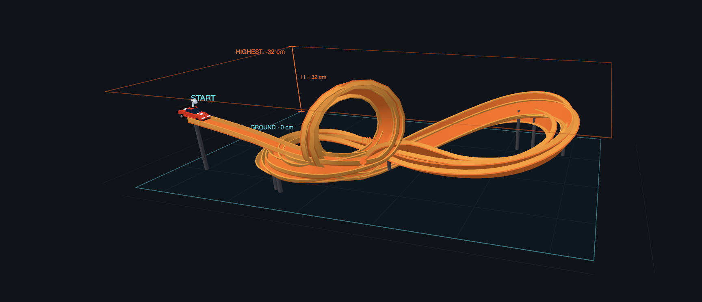
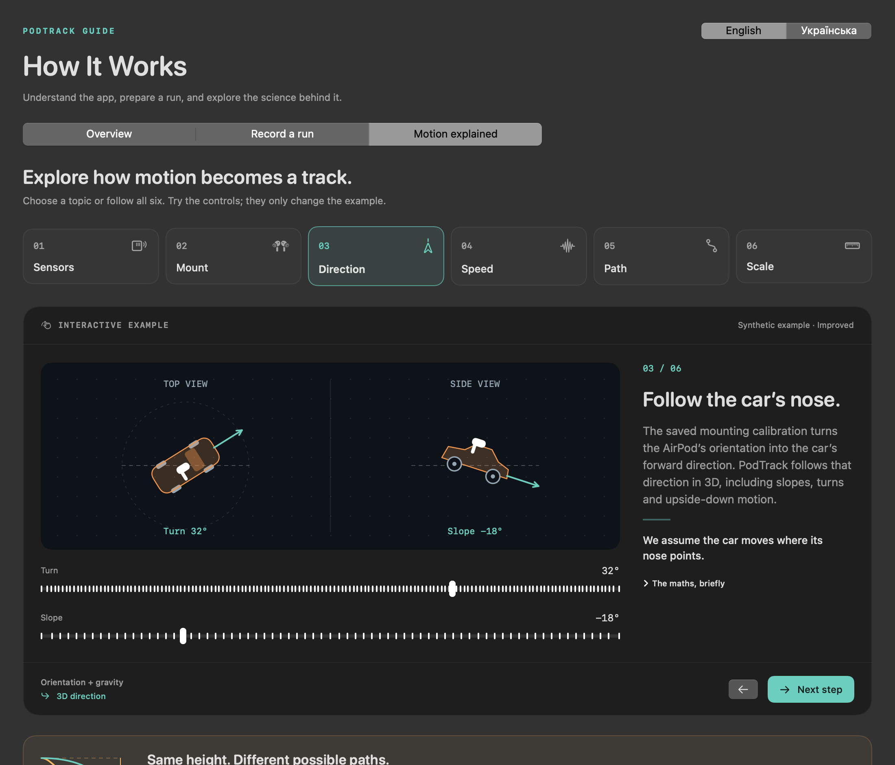

# PodTrack



*A looped track in PodTrack's 3D view.*

A Mac app that records movement from an AirPod attached to a Hot Wheels car. See an estimated 3D track, replay a run, and compare cars.

**Track shape, speed, and distance are estimates.** AirPods do not measure position or speed directly. Errors can grow during a run, and real-world accuracy has not yet been measured.

## Get started

You need **macOS 14 or newer** and **Xcode 15 or newer** with Swift 5.9 or newer to build the app. To record a real car, you also need compatible AirPods, such as AirPods Pro, and a firm mount.

From the project folder, run:

```sh
bash scripts/build.sh
open build/PodTrack.app
```

After a rebuild, quit PodTrack with **⌘Q** before opening it again. You can also open `PodTrack.xcodeproj` in Xcode, choose **PodTrack → My Mac**, and run it.

**Try it without AirPods:** choose **Simulation** in the sidebar, open **Record**, and click **Simulate & record**. A sample run is saved in **Runs**.

## Record a run

1. **Connect.** Pair your AirPods with the Mac. In **Record**, choose **Right** or **Left** and connect. Move that AirPod and check that its motion data arrives. macOS chooses which AirPod sends data; PodTrack's selector cannot force a change.
2. **Calibrate.** Fix the AirPod to the car. Keep the car level and click **Capture level**. Then raise its nose **15–45°**, without tilting sideways, and click **Capture & save**. Hold each pose still until it is accepted.
3. **Set the scale, if you can.** Enter **H**, the vertical distance between the lowest and highest points the car visits. You can also enter the length along the track in **Notes & advanced settings**. Leave **Unknown** selected if you have no measurement.
4. **Record and save.** Click **Start recording**. Keep the car still for one second, then release it. Wait one second after it stops, then click **Stop & save** before picking it up.

Calibrate again when the AirPod moves on the car. Record one car at a time.

Without a measured height or length, the full path is shown as **1 relative unit (u)**. You can add a measurement to a saved run later to get estimates in metres and m/s. A matching height or length does not prove that the track shape is correct.

## View and compare runs

Open **Runs** to search, sort, and open your recordings.

- **3D Track:** rotate the view, replay the car, or measure between two points. The timeline lets you view or export part of a run.
- **Analysis:** inspect speed graphs, motion data, and possible events such as bumps or jumps.
- **Compare runs:** select two to four saved runs and play them together. If any run has no known scale, all paths use relative units for the comparison.
- **Compare algorithms:** open a run, then choose **Advanced → Compare algorithms**. This compares **Improved**, the default method, with **Old** using the same recording.

## Help

Open **Learn → How It Works** for a short overview, recording steps, and interactive examples. The guide is available in **English and Ukrainian**.

<details>
<summary>See the interactive guide</summary>



*An example from the app's Motion explained section.*

</details>

**No motion data?** Open **Device → Diagnostics** and check the reported AirPod side. Follow the connection screen's **Setup guide**, then retry. See the [AirPods setup pictures and Ukrainian instructions](docs/AIRPODS_SETUP.md).

**No 3D track?** Check the reason shown for that run. **Raw only · no 3D** saves motion data without a track. For a new 3D run, turn it off and calibrate before recording. Unknown height alone does not prevent a 3D view.

## Your data

Everything stays on your Mac. No account or cloud service is needed. Recordings are saved here:

```text
~/Library/Application Support/PodTrack/Runs/
```

Export a run as **CSV or JSON**, or export several files as a **ZIP**. Deleted runs go to **Recently Deleted**, where you can restore them. If a save fails, use **Retry save** or export the recording before closing the app.

## Development

The app is written in Swift, using SwiftUI, Core Motion, Swift Charts, and SceneKit.

```sh
bash scripts/test.sh
```

- [Build, test, and preview commands](docs/DEVELOPMENT.md)
- [Improved method and its limits](docs/IMPROVED_RECONSTRUCTION.md)
- [Old method](docs/RECONSTRUCTION.md)
- [Test results and known issues](docs/VALIDATION.md)
