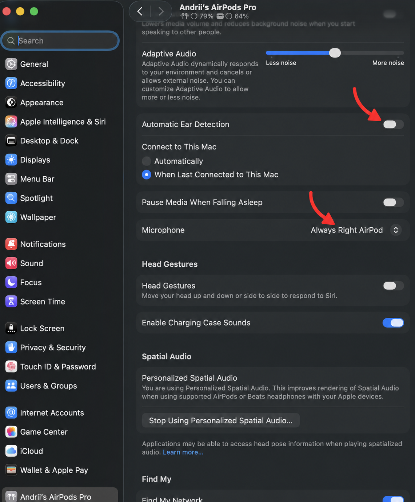
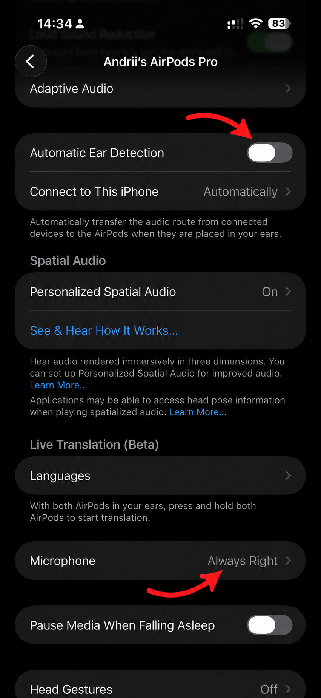

# Налаштування AirPods перед записом

1. Підключіть AirPods і відкрийте їхні налаштування: **iPhone → Settings → ваші AirPods** або **Mac → System Settings → ваші AirPods**. Якщо пункту немає, відкрийте **Audio & Routing**.
2. У **Microphone** виберіть **Always Right** для правого навушника або **Always Left** для лівого — відповідно до боку, який вибрали для запису в PodTrack. На ілюстрації показано правий навушник.
3. Для навушника на машинці вимкніть **Automatic Ear Detection**, поки AirPods підключені. Перевірте, що дані продовжують надходити після закріплення.
4. На Mac поверніться в PodTrack, натисніть **Retry connection** і перевірте, що **Required** та **Stream** показують потрібний бік. Порухайте тільки цей навушник: поточний нахил має реагувати.

Налаштування Microphone вибирає аудіовхід. Джерело даних руху визначає macOS, тому фактичний бік завжди перевіряйте в **Stream**.

[Налаштування AirPods — Apple](https://support.apple.com/108764)

## Ілюстрації Mac та iPhone

Натисніть **Connection → Setup guide**: під кнопкою з’явиться коротке нагадування вибрати мікрофон і вимкнути Automatic Ear Detection. Кнопка **Show Mac & iPhone screenshots** відкриває повну інструкцію з вкладками **Mac** та **iPhone**. За замовчуванням показано Mac.

### Mac

Дві стрілки вказують на **Automatic Ear Detection → Off** та **Microphone → Always Right AirPod**.



[Відкрити PNG для Mac](../Sources/PodTrack/Resources/airpods-mac-setup.png)

### iPhone

Дві червоні стрілки показують **Automatic Ear Detection → Off** та **Microphone → Always Right**. Зображення також доступне в PodTrack через **Connection → Setup guide → Show Mac & iPhone screenshots → Open full-size screenshot**.



[Відкрити PNG](../Sources/PodTrack/Resources/airpods-microphone-setup.png)

<details>
<summary>Походження ілюстрації та запит редагування</summary>

Основа — скриншот, наданий користувачем. Стрілку додано вбудованим інструментом image_gen; CLI не використовувався. Результат збережено в ресурсах проєкту. Це анотована ілюстрація налаштувань, а не показник поточного підключення.

Запит редагування:

```text
Use case: precise-object-edit.
Asset type: annotated screenshot for PodTrack setup instructions.
Input image 1 is the edit target: the user's full portrait iPhone AirPods settings screenshot.
Primary request: add exactly ONE clear bright red curved arrow pointing to the existing “Always Right” value in the “Microphone” row near the lower part of the screenshot.
Place the arrow's tail in the empty black gap immediately below the Microphone row, above the “Pause Media When Falling Asleep” row. Curve up and right so its arrowhead ends just beneath the “Always Right” text, clearly identifying that setting without covering any letters. Use a clean, bold, rounded red stroke that is visible when the screenshot is displayed smaller.
Constraints: preserve the entire original screenshot, portrait framing, proportions, dark appearance, every word, number, icon, and switch state. In particular keep “Microphone” and “Always Right” exactly as shown. Add no labels, new text, circles, borders, or other arrows. Do not redraw or redesign the interface. Keep all content outside the new arrow unchanged.
```

Додаткове редагування: друга стрілка, виконано вбудованим image_gen.

```text
Edit the provided annotated iPhone settings screenshot. Keep the existing red curved arrow at Microphone → Always Right. Add ONE matching bold red curved arrow in the empty black gap above the Automatic Ear Detection row, pointing down and right to its gray OFF toggle. End the arrow just above the toggle without obscuring it. The switch must remain gray with its white knob on the LEFT (OFF). The final image must have exactly TWO red arrows: one at Automatic Ear Detection OFF, and the existing one at Microphone Always Right. Preserve all screenshot text, settings, icons, framing, layout and existing arrow. Do not add any new text or change any toggle.
```

Анотування скриншота Mac: вбудований image_gen.

```text
Edit the provided macOS System Settings screenshot with exactly TWO bold red curved arrows. One arrow points to the gray OFF toggle at the right end of the Automatic Ear Detection row (about x95%, y25%). Keep its white knob on the LEFT and the toggle gray. The other arrow points to the existing 'Always Right AirPod' value in the Microphone row (about x84%, y46%). Place arrows in nearby empty space, with tips just beside the targets; do not obscure text or switches. Preserve the full screenshot framing, all original text, icons, settings and colors. Add no labels or other marks. Clean rounded red strokes, similar to screenshot instructional annotations.
```

</details>
